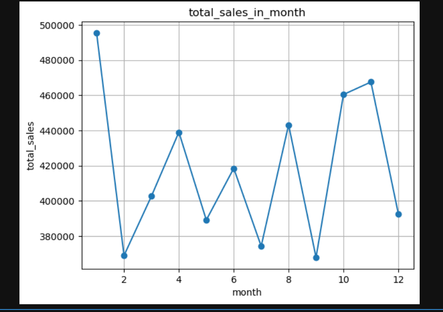
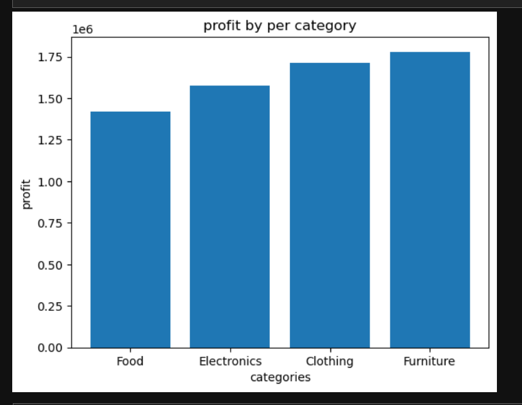
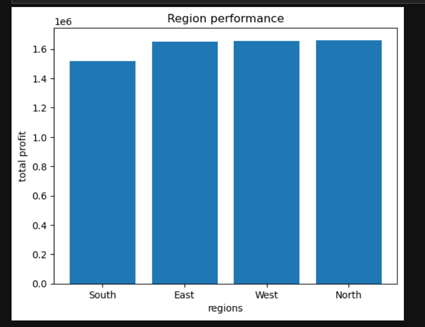
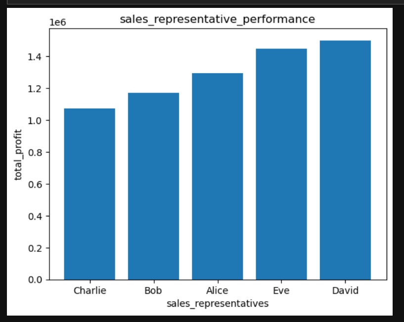
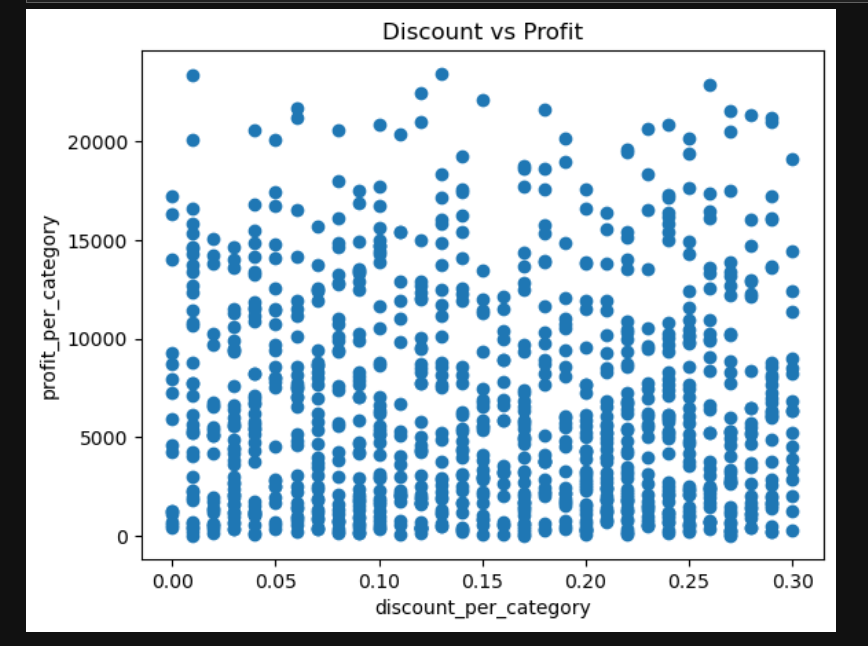

# 📊 Sales Data Analysis & Visualization Using Python

## 📌 Project Overview

This project focuses on analyzing and visualizing sales data using Python to identify important business insights related to **sales performance, profitability, regional performance, sales representatives, customer behavior, discounts, and seasonal trends**.

The objective of this project is to transform raw sales data into meaningful insights that can help businesses make **data-driven decisions** and improve their overall sales and profitability.

---

## 🎯 Business Objective

The main objectives of this project are:

* Analyze overall sales and profitability.
* Identify the most profitable product categories.
* Evaluate regional sales performance.
* Analyze sales representative performance.
* Understand the impact of discounts on profit.
* Analyze customer behavior and payment preferences.
* Identify seasonal patterns in sales.
* Detect potential outliers in profit.
* Provide actionable business recommendations based on the analysis.

---

## 📊 Dataset

* **Dataset Name:** Sales Dataset
* **Source:** Kaggle
* **Number of Rows:** 1,000
* **Number of Columns:** 14

### Dataset Columns

```text
Product_ID
Sale_Date
Sales_Rep
Region
Sales_Amount
Quantity_Sold
Product_Category
Unit_Cost
Unit_Price
Customer_Type
Discount
Payment_Method
Sales_Channel
Region_and_Sales_Rep
```

---

## 🛠️ Tools & Technologies

The following tools and Python libraries were used:

* **Python**
* **NumPy** – Numerical operations
* **Pandas** – Data manipulation and analysis
* **Matplotlib** – Data visualization
* **Seaborn** – Statistical data visualization
* **Jupyter Notebook** – Development and analysis environment

---

## 🧹 Data Cleaning & Preprocessing

The following data preprocessing steps were performed:

* Checked for missing values.
* Checked for duplicate records.
* Checked data types of all columns.
* Converted relevant columns into appropriate data types.
* Converted the sales date column into `datetime` format.
* Checked and standardized column names.
* Converted column names to lowercase.
* Replaced spaces in column names with underscores.

These steps helped ensure that the dataset was clean and suitable for further analysis.

---

## 🔍 Analysis Performed

The following business questions and analytical areas were explored:

### 1. Product Category Analysis

* Identified the most profitable product category.
* Compared profitability across categories.

### 2. Sales Representative Analysis

* Analyzed sales representative performance.
* Identified the highest and lowest performing sales representatives.

### 3. Regional Performance

* Compared profitability across different regions.
* Identified high-performing and lower-performing regions.

### 4. Discount Analysis

* Analyzed the relationship between discounts and profit.
* Evaluated whether higher discounts resulted in higher profitability.

### 5. Customer Behavior Analysis

* Analyzed customer behavior based on customer type.
* Examined customer payment preferences.

### 6. Time Analysis

* Analyzed monthly sales trends.
* Identified months with higher and lower sales performance.

### 7. Yearly Sales Analysis

* Compared sales performance across different years.

### 8. Outlier Analysis

* Identified potential outliers in profit.
* Used boxplot visualization to understand the distribution of total profit.

---

## 📈 Visualizations

The project includes the following visualizations:

## 📊 Key Visualizations

### Sales Trend


### Profit by Category


### Regional Performance


### Sales Representative Performance


### Discount vs Profit


### Profit Distribution Using Boxplot


These visualizations were created using **Matplotlib and Seaborn**.

---

## 💡 Key Insights

### Product Category

Furniture was identified as the most profitable product category, making it an important contributor to overall business profitability.

### Regional Performance

The **North region** generated the highest profit, while the **South region** showed comparatively lower performance. Overall, regional performance was relatively balanced.

### Sales Representative Performance

Sales representatives showed different levels of performance. **David** generated the highest total profit, while **Charlie** contributed the least.

### Discount & Profitability

The discount analysis showed **no strong positive relationship between discount and profit**. This indicates that providing higher discounts does not necessarily result in higher profitability.

### Seasonal Sales Trends

Monthly sales showed fluctuations, with **January, October, and November** showing strong performance. This suggests the possibility of seasonal demand patterns.

### Customer Behavior

Customer behavior analysis showed that **new customers preferred Bank Transfer**, while **returning customers preferred Credit Card**. Overall, payment preferences were relatively balanced.

### Outlier Analysis

The analysis identified some high-profit transactions as potential outliers. These transactions appear to represent genuine high-value sales and can provide useful business insights rather than simply being treated as errors.

---

## 💼 Business Recommendations

Based on the analysis, the following recommendations were proposed:

1. **Focus on High-Profit Categories**
   Promote profitable categories such as Furniture to improve overall profitability.

2. **Improve South Region Performance**
   Investigate the factors affecting South region performance and develop strategies to improve sales and profitability.

3. **Learn from High-Performing Sales Representatives**
   Analyze the strategies used by top performers such as David and apply successful practices to improve the performance of other team members.

4. **Optimize Discount Strategies**
   Avoid excessive discounting and evaluate discounts based on their actual impact on profitability.

5. **Plan for High-Performing Months**
   Increase marketing efforts and inventory planning during high-performing months to take advantage of increased demand.

6. **Maintain Multiple Payment Options**
   Continue supporting multiple payment methods to accommodate different customer preferences.

---

## 📝 Conclusion

This project analyzed sales data to uncover important insights related to **profitability, customer behavior, regional performance, sales representatives, discount impact, and seasonal sales patterns**.

The analysis demonstrates how Python and data visualization techniques can be used to transform raw sales data into meaningful business insights.

The findings can help businesses make **data-driven decisions, improve profitability, optimize sales strategies, understand customer behavior, and identify opportunities for business growth**.

---

## 📂 Project Structure

```text
Sales-Data-Analysis/
│
├── sales_analysis_project.ipynb
├── sales_dataset.csv
└── README.md
```

---

## 🚀 How to Run the Project

### 1. Clone the repository

```bash
git clone https://github.com/sumitjuwar3457-bit/Python-Sales-Data-Analysis.git
```

### 2. Navigate to the project folder

```bash
cd Sales-Data-Analysis
```

### 3. Open the Jupyter Notebook

```bash
jupyter notebook
```

### 4. Open

```text
sales_analysis_project.ipynb
```

Run the notebook cells sequentially to reproduce the analysis and visualizations.

---

## 👨‍💻 Project Type

**Data Analyst Portfolio Project**

This project demonstrates practical skills in:

```text
Python
NumPy
Pandas
Data Cleaning
Exploratory Data Analysis (EDA)
Data Visualization
Business Analysis
Business Insights
Data-Driven Recommendations
```

